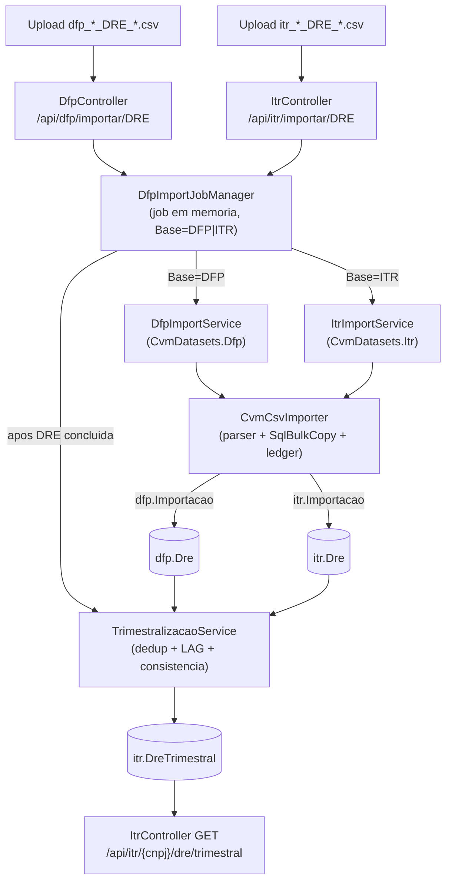

# Arquitetura de Importação e Análise — DFP.DRE × ITR.DRE

## 1. Visão geral

O sistema importa CSVs da CVM (open data) para o SQL Server e, no caso da DRE, deriva uma série **trimestral de-acumulada**. Há **duas bases isoladas** que compartilham o mesmo núcleo de importação:

- **DFP** (anual) → schema `dfp` → tabela `dfp.Dre`
- **ITR** (trimestral) → schema `itr` → tabela `itr.Dre`

O único ponto de cruzamento é o **motor de trimestralização**, que une as duas fontes em `itr.DreTrimestral`.



---

## 2. Componentes

| Camada | DFP | ITR | Compartilhado |
|---|---|---|---|
| Controller | `DfpController` (`/api/dfp`) | `ItrController` (`/api/itr`) | — |
| Serviço de import (fino) | `DfpImportService` | `ItrImportService` | — |
| Núcleo de import | — | — | `CvmCsvImporter` |
| Descritor de dataset | `CvmDatasets.Dfp` | `CvmDatasets.Itr` | `CvmDataset` |
| Ledger | `dfp.Importacao` | `itr.Importacao` | `CvmImportacaoLog` (parametrizado pela tabela) |
| Registry de colunas | `DfpDemonstracaoRegistry` (DRE = `ColsResultado`) | reaproveita o mesmo layout DRE | `DfpDemonstracaoRegistry` |
| Job manager | `DfpImportJobManager` (despacha por `Base`) | idem | `IDfpImportJobManager` |
| Motor trimestral | — | `TrimestralizacaoService` | — |
| Leitura | `DfpRepository` | `ItrRepository` | — |

O descritor que isola DFP de ITR (`backend/Services/CvmDataset.cs`):

```csharp
public static readonly CvmDataset Dfp = new()
{
    Codigo = "DFP",
    LedgerTabela = "dfp.Importacao",
    Resolver = tipo =>
    {
        var dem = DfpDemonstracaoRegistry.Resolver(tipo);
        return dem is null ? null : new CvmDemonstracaoDestino(dem, dem.Tabela);
    },
};

public static readonly CvmDataset Itr = new()
{
    Codigo = "ITR",
    LedgerTabela = "itr.Importacao",
    Resolver = tipo =>
    {
        var dem = DfpDemonstracaoRegistry.Resolver(tipo);
        if (dem is null || !string.Equals(dem.Tipo, "DRE", StringComparison.OrdinalIgnoreCase))
            return null;
        return new CvmDemonstracaoDestino(dem, "itr.Dre");
    },
};
```

> Observação-chave: ITR e DFP usam **exatamente o mesmo layout de colunas da DRE** (`ColsResultado` em `DfpDemonstracaoRegistry`). A diferença é apenas o **schema/tabela destino** (`itr.Dre` vs `dfp.Dre`) e o **ledger** (`itr.Importacao` vs `dfp.Importacao`).

---

## 3. Fluxo de importação (passo a passo)

1. **Upload** → o controller salva o CSV em `App_Data/imports/{guid}.csv` e chama `IDfpImportJobManager.Iniciar(...)` com `baseDados = "DFP"` ou `"ITR"`.
2. **Job em memória** (`DfpImportJobManager`) roda em background, cria um escopo de DI e **despacha pelo dataset**:

```csharp
// Despacho por dataset: ITR grava em [itr], DFP em [dfp] (servicos isolados,
// mesma assinatura, sobre o nucleo compartilhado CvmCsvImporter).
var resultado = job.Base == "ITR"
    ? await scope.ServiceProvider.GetRequiredService<IItrImportService>()
        .ImportarArquivoAsync(job.Tipo, job.CaminhoTemp, job.Arquivo, job.Usuario, progresso, ct)
    : await scope.ServiceProvider.GetRequiredService<IDfpImportService>()
        .ImportarArquivoAsync(job.Tipo, job.CaminhoTemp, job.Arquivo, job.Usuario, progresso, ct);
```

3. **Parse + carga** (`CvmCsvImporter`): lê o cabeçalho, mapeia colunas, detecta conjunto, extrai ano, **apaga o escopo** e grava em lotes via `SqlBulkCopy`, registrando tudo no ledger.
4. **Gatilho de recálculo**: ao concluir uma importação **de DRE** (ITR ou DFP), o job manager dispara a trimestralização do escopo afetado (`Ano` + `Conjunto`), de forma tolerante a falha:

```csharp
private async Task TentarRecalcularTrimestralizacaoAsync(
    IServiceProvider services, DfpImportJob job, DfpImportResult resultado, CancellationToken ct)
{
    if (!string.Equals(resultado.Tipo, "DRE", StringComparison.OrdinalIgnoreCase))
        return;

    try
    {
        var conjunto = resultado.Conjunto is "CON" or "IND" ? resultado.Conjunto : null;
        var engine = services.GetRequiredService<ITrimestralizacaoService>();
        await engine.RecalcularAsync(resultado.Ano, conjunto, cnpj: null, ct);
    }
    catch (Exception ex)
    {
        _logger.LogError(ex, /* ... */);
    }
}
```

Há também o recálculo manual via `POST /api/itr/dre/trimestralizar?cnpj=&conjunto=&ano=` (sem filtros = recalcula tudo).

---

## 4. Regras de análise por item (parser do CSV)

Aplicadas linha-a-linha em `CvmCsvImporter` (idênticas para DFP e ITR):

| Regra | Detalhe | Onde |
|---|---|---|
| **Encoding** | ISO-8859-1 (`Encoding.Latin1`) | constante `Latin1` |
| **Separador** | `;` | constante `Separator` |
| **Mapeamento de colunas** | casa o cabeçalho do CSV (case-insensitive) contra o registry; colunas desconhecidas são ignoradas, ausentes ficam nulas | `ImportarArquivoAsync` |
| **Linhas com `;` extra** | excesso de campos é reagrupado no último (ex.: textos livres) | `SplitRow` |
| **Ano de referência** | extraído do **nome do arquivo** (primeiro `19xx`/`20xx`); se não achar, a importação falha | `ExtrairAno` |
| **Conjunto (CON/IND)** | derivado de `GRUPO_DFP` ("DF Consolidado…" → CON; "DF Individual…" → IND); fallback pelo nome do arquivo (`_con_`/`_ind_`) | `ResolverConjunto` / `ResolverConjuntoPorNome` |
| **Conjunto do arquivo (escopo)** | espiado na 1ª linha de dados; se o arquivo trouxer CON e IND → marcado como **MIS** (misto) | `ConjuntoAcumulado` |
| **Conversão de tipos** | `Date` (`yyyy-MM-dd`), `Short/Int/Long`, `Decimal` (ponto decimal; vírgula tolerada); inválido → `NULL` | `Convert` / `ParseDecimal` |
| **Substituição de escopo** | antes da carga, **DELETE** por `(Ano, Conjunto)` quando há conjunto, ou só `(Ano)` | `LimparEscopoAsync` |
| **Carga** | `SqlBulkCopy` em lotes de 10.000 linhas, commit incremental, cancelamento cooperativo | loop principal |
| **Auditoria por linha** | preenche `Conjunto`, `Ano`, `ImportacaoId`, `ArquivoOrigem`; `CnpjNum` é coluna calculada/persistida | `BuildTable` |
| **Rastreio** | ledger por importação (Tipo/Tabela/Conjunto/Ano/Arquivo + contagens + status) | `CvmImportacaoLog` |

**Implicação importante para a DRE:** tanto `dfp.Dre` quanto `itr.Dre` guardam o `VL_CONTA` **acumulado** como vem da CVM (DFP = acumulado até 31/12; ITR = acumulado até 31/03, 30/06, 30/09). A de-acumulação **não** acontece no import — acontece no motor (seção 5).

---

## 5. Motor de trimestralização — regras de análise

Implementado em `TrimestralizacaoService.RecalcularAsync(ano?, conjunto?, cnpj?)` (`backend/Services/TrimestralizacaoService.cs`) como **um único SQL** com window functions; persiste por **DELETE do escopo + INSERT** em transação.

### 5.1 Fontes e filtros

```sql
WITH fonte AS (
    SELECT ... 'ITR' AS Origem
    FROM itr.Dre
    WHERE ORDEM_EXERC COLLATE Latin1_General_CI_AI = 'ULTIMO'
      AND DT_FIM_EXERC IS NOT NULL
      AND MONTH(DT_FIM_EXERC) IN (3, 6, 9)
    UNION ALL
    SELECT ... 'DFP' AS Origem
    FROM dfp.Dre
    WHERE ORDEM_EXERC COLLATE Latin1_General_CI_AI = 'ULTIMO'
      AND DT_FIM_EXERC IS NOT NULL
      AND MONTH(DT_FIM_EXERC) = 12
),
```

- **T1/T2/T3** vêm de `itr.Dre` (DT_FIM em mar/jun/set).
- **T4** vem de `dfp.Dre` (DT_FIM em dez, valor anual acumulado).
- **`ORDEM_EXERC = ULTIMO`** com `COLLATE Latin1_General_CI_AI` → comparação acento-insensível (cobre "ÚLTIMO").
- Filtra `Conjunto IS NOT NULL` e aplica os filtros opcionais de escopo (`@ano` por `YEAR(DT_FIM_EXERC)`, `@conjunto`, `@cnpjNum`).

### 5.2 Regras item a item

| # | Regra | Implementação |
|---|---|---|
| **R1 — Deduplicação** | mantém a **maior `VERSAO`** por `(CD_CVM, Conjunto, CD_CONTA, DT_FIM_EXERC)` via `ROW_NUMBER() … ORDER BY VERSAO DESC` → `rn = 1` | CTE `dedup` |
| **R2 — Trimestre** | `Trimestre = MONTH(DT_FIM_EXERC) / 3` → 3→1, 6→2, 9→3, 12→4 | CTE `unico` |
| **R3 — De-acumulação** | `ValorTrimestral = VL_CONTA − ISNULL(LAG(VL_CONTA), 0)`, particionado por `(CD_CVM, Conjunto, CD_CONTA, Ano)` ordenado por `Trimestre`. T1 = o próprio valor | CTE `serie` + SELECT |
| **R4 — Valor acumulado** | `ValorAcumulado = VL_CONTA` (preserva o original da CVM) | SELECT |
| **R5 — Origem** | grava `OrigemTrimestre` = `'ITR'` (T1–T3) ou `'DFP'` (T4) | SELECT |
| **R6 — Inconsistência** | marca `Inconsistente = 1` quando há **trimestre intermediário ausente** (`Trimestre − LAG(Trimestre) > 1`), **exceto** o salto aceito 1T→4T quando o 4T vem do DFP | CASE no SELECT |
| **R7 — Registro único ≠ T1** | grupos `(…, Ano)` com **um único** registro que **não** é o T1 são **ignorados** (não geram linha) | `WHERE NOT (QtdTri = 1 AND Trimestre <> 1)` |
| **R8 — Escala monetária** | `EscalaMoeda` é persistida e a multiplicação por mil/milhão é aplicada **no frontend** | SELECT |

### 5.3 Persistência (escopo)

```sql
-- 1. Remove o escopo a recalcular de itr.DreTrimestral.
DELETE FROM itr.DreTrimestral
 WHERE (@ano      IS NULL OR Ano      = @ano)
   AND (@conjunto IS NULL OR Conjunto = @conjunto)
   AND (@cnpjNum  IS NULL OR CnpjNum  = @cnpjNum);

-- 2. Recalcula e grava a serie trimestral de-acumulada (INSERT ... SELECT).
```

Tudo dentro de uma transação. A unicidade final é garantida pela constraint `UQ_Itr_DreTrimestral (CD_CVM, Conjunto, Ano, Trimestre, CD_CONTA)` (migração `V010`), coerente com a partição da R1.

### 5.4 Exemplo de de-acumulação (uma conta, um ano)

| Trimestre | Origem | VL_CONTA (acumulado) | LAG | ValorTrimestral | Inconsistente |
|---|---|---|---|---|---|
| T1 | ITR | 100 | — | 100 | 0 |
| T2 | ITR | 250 | 100 | 150 | 0 |
| T3 | ITR | 420 | 250 | 170 | 0 |
| T4 | DFP | 600 | 420 | 180 | 0 |

Caso só exista **1T (ITR) + 4T (DFP)** (faltam 2T/3T): T4 = 600 − valor do T1; `Inconsistente = 0` (salto 1→4 com 4T de DFP é aceito por R6). Já um 1T→3T sem 2T marcaria `Inconsistente = 1`.

---

## 6. Isolamento DFP × ITR (decisões arquiteturais)

- **Schemas independentes**: `dfp.*` e `itr.*` com tabelas, ledgers e índices próprios (migrações `V009`/`V010`). `itr.Dre` **não** tem coluna `Origem` — o schema já identifica a origem.
- **Núcleo único de parsing**: `CvmCsvImporter` evita duplicação; os serviços `DfpImportService`/`ItrImportService` apenas fixam o `CvmDataset`.
- **Endpoints separados**: `/api/dfp/*` e `/api/itr/*`; o `ItrController` valida que só `DRE` é aceito na base ITR.
- **DELETE de escopo isolado por construção**: cada base apaga só dentro do seu schema, por `(Ano, Conjunto)`.
- **Leitura anual da DRE permanece intacta** (tela "Leitura de DRE" usa `api/dfp`); a trimestral é a tela "Leitura de ITR (Trimestral)" via `api/itr`.

---

## 7. Resumo das regras (cola rápida)

- **Import (parser):** ISO-8859-1, `;`, mapeia por cabeçalho, ano pelo nome do arquivo, conjunto por `GRUPO_DFP`, DELETE por `(Ano, Conjunto)`, bulk em lotes de 10k, ledger por importação.
- **Trimestral (motor):** ITR=mês 3/6/9 (T1–T3) + DFP=mês 12 (T4) · `ORDEM_EXERC=ULTIMO` (acento-insensível) · dedup `MAX(VERSAO)` · `Trimestre=MONTH/3` · de-acumula via `LAG` · marca inconsistência por gap (exceto 1T→4T do DFP) · ignora grupo de registro único ≠ T1 · DELETE+INSERT por escopo `(Ano/Conjunto/CnpjNum)`.

---

## 8. Referência de arquivos

| Arquivo | Papel |
|---|---|
| `backend/Services/CvmCsvImporter.cs` | Núcleo de parsing/bulk/ledger (DFP e ITR) |
| `backend/Services/CvmDataset.cs` | Descritores `CvmDatasets.Dfp` / `CvmDatasets.Itr` |
| `backend/Services/CvmImportacaoLog.cs` | Ledger genérico parametrizado pela tabela |
| `backend/Services/DfpImportService.cs` / `ItrImportService.cs` | Adaptadores finos por base |
| `backend/Services/DfpImportJobManager.cs` | Job em memória + despacho por base + gatilho de recálculo |
| `backend/Services/TrimestralizacaoService.cs` | Motor de trimestralização (de-acumulação) |
| `backend/Services/DfpRepository.cs` / `ItrRepository.cs` | Leitura anual / trimestral |
| `backend/Controllers/DfpController.cs` / `ItrController.cs` | Endpoints `/api/dfp` e `/api/itr` |
| `backend/Migrations/V009__create_itr_schema.sql` | Schema `itr` (itr.Dre + itr.Importacao + índices) |
| `backend/Migrations/V010__create_itr_dre_trimestral.sql` | `itr.DreTrimestral` + `itr.vw_DreTrimestral` |
