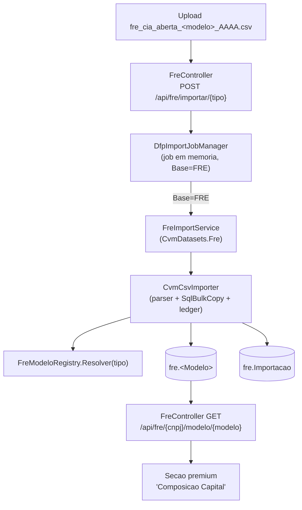

# Arquitetura de Importação e Análise — FRE (Formulário de Referência)

## 1. Visão geral

A base **FRE** importa os CSVs do Formulário de Referência da CVM (open data) para o SQL Server, **uma tabela por modelo** no schema `fre`. Reaproveita integralmente o núcleo de importação já usado por DFP/ITR (`CvmCsvImporter`): muda apenas o **descritor de dataset** (`CvmDatasets.Fre`), o **registry de modelos** (`FreModeloRegistry`) e o **schema destino** (`fre`).

Diferenças relevantes em relação a DFP/ITR:

- **Sem `GRUPO_DFP`** → FRE não distingue Consolidado/Individual: todos os modelos são `TemConjunto:false` e a reimportação substitui por **(Ano)**.
- **Modelo identificado pelo nome do arquivo** (`fre_cia_aberta_<modelo>_AAAA.csv`), não por um campo interno.
- **Não dispara trimestralização** (esse gatilho é exclusivo da DRE).



---

## 2. Componentes

| Camada | FRE | Compartilhado |
|---|---|---|
| Controller | `FreController` (`/api/fre`) | — |
| Serviço de import (fino) | `FreImportService` | `CvmCsvImporter` |
| Descritor de dataset | `CvmDatasets.Fre` | `CvmDataset` |
| Ledger | `fre.Importacao` | `CvmImportacaoLog` (parametrizado pela tabela) |
| Registry de modelos | `FreModeloRegistry` (~50 modelos) | `DfpColumn`/`DfpColumnKind`/`DfpDemonstracao` |
| Job manager | `DfpImportJobManager` (despacha por `Base`) | `IDfpImportJobManager` |
| Leitura | `FreRepository` | — |

O descritor que isola FRE (`backend/Services/CvmDataset.cs`):

```csharp
public static readonly CvmDataset Fre = new()
{
    Codigo = "FRE",
    LedgerTabela = "fre.Importacao",
    Resolver = tipo =>
    {
        var dem = FreModeloRegistry.Resolver(tipo);
        return dem is null ? null : new CvmDemonstracaoDestino(dem, dem.Tabela);
    },
};
```

O despacho do job por base (`backend/Services/DfpImportJobManager.cs`):

```csharp
var resultado = job.Base switch
{
    "FRE" => await scope.ServiceProvider.GetRequiredService<IFreImportService>()
        .ImportarArquivoAsync(job.Tipo, job.CaminhoTemp, job.Arquivo, job.Usuario, progresso, ct),
    "ITR" => await scope.ServiceProvider.GetRequiredService<IItrImportService>()
        .ImportarArquivoAsync(job.Tipo, job.CaminhoTemp, job.Arquivo, job.Usuario, progresso, ct),
    _ => await scope.ServiceProvider.GetRequiredService<IDfpImportService>()
        .ImportarArquivoAsync(job.Tipo, job.CaminhoTemp, job.Arquivo, job.Usuario, progresso, ct),
};
```

---

## 3. Detecção do modelo pelo nome do arquivo

`FreModeloRegistry.IdentificarPorArquivo(nome)`:

1. Remove a extensão e normaliza para minúsculas.
2. Exige o prefixo `fre_cia_aberta`.
3. Remove o **sufixo do ano** (`_AAAA`). Se o que sobra for apenas o ano (ex.: `fre_cia_aberta_2024.csv`), o modelo é **DOCUMENTO**.
4. O restante é casado **exato** (case-insensitive) contra as chaves do registry — o match exato evita ambiguidade entre `capital_social`, `capital_social_aumento` e `capital_social_aumento_classe_acao`.

O endpoint `GET /api/fre/identificar?arquivo=...` expõe essa detecção para o frontend pré-validar o upload.

---

## 4. Esquema `fre` e migrações

Cada tabela espelha **1:1** o layout nativo da CVM (nomes/tipos das colunas, a partir dos metadados `meta_fre_cia_aberta_*`) + colunas de auditoria:

- `Id BIGINT IDENTITY` (PK)
- colunas nativas (`VARCHAR(n)` / `DATE` / `DATETIME2` / `SMALLINT` / `INT` / `BIGINT` / `DECIMAL(p,s)`)
- `Ano SMALLINT`, `ImportacaoId BIGINT`, `ArquivoOrigem NVARCHAR(260)`
- `CnpjNum` (coluna **computada/persistida** a partir de `CNPJ_Companhia`/`CNPJ_CIA`) + índice `(CnpjNum, Ano)`
- `ImportadoEmUtc DATETIME2 DEFAULT SYSUTCDATETIME()`

| Migração | Conteúdo |
|---|---|
| `V013__create_fre_schema.sql` | schema `fre` + `fre.Importacao` (ledger) + `fre.Documento` (índice) |
| `V014__create_fre_capital.sql` | grupo de capital (capital social, aumentos/reduções/desdobramentos, distribuição, posição acionária, direito de ação) |
| `V015__create_fre_valores_mobiliarios.sql` | titulares/volume/tesouraria, títulos no exterior, mercados estrangeiros, recompra, ações entregues e participações |
| `V016__create_fre_remuneracao.sql` | remuneração por órgão, variável, em ações e máxima/mínima/média |
| `V017__create_fre_governanca.sql` | administradores, comitês, conselho fiscal, auditores, política de negociação e relações |
| `V018__create_fre_demais.sql` | empregados, ativos imobilizado/intangível, histórico, grupo econômico e partes relacionadas |
| `V019__create_fre_views.sql` | `fre.vw_CapitalResumo` (ON/PN/total + free float por empresa/ano) |

Mapeamento de tipos (meta → SQL/Kind): `varchar`→`VARCHAR(n)`/Text, `char`→`CHAR(n)`/Text, `date`→`DATE`/Date, `datetime`→`DATETIME2`/Date, `smallint`→`SMALLINT`/Short, `int`→`INT`/Int, `bigint`→`BIGINT`/Long, `numeric(p,s)`→`DECIMAL(p,s)`/Decimal.

---

## 5. Mapa de modelos → tabelas

Todos os modelos são `TemConjunto:false`. A chave (`tipo`) é o nome enviado em `POST /api/fre/importar/{tipo}` e detectado pelo nome do arquivo.

### Documento (V013)

| Chave (tipo) | Tabela |
|---|---|
| `DOCUMENTO` | `fre.Documento` |

### Grupo de capital (V014)

| Chave (tipo) | Tabela |
|---|---|
| `capital_social` | `fre.CapitalSocial` |
| `capital_social_classe_acao` | `fre.CapitalSocialClasseAcao` |
| `capital_social_aumento` | `fre.CapitalSocialAumento` |
| `capital_social_aumento_classe_acao` | `fre.CapitalSocialAumentoClasseAcao` |
| `capital_social_reducao` | `fre.CapitalSocialReducao` |
| `capital_social_reducao_classe_acao` | `fre.CapitalSocialReducaoClasseAcao` |
| `capital_social_desdobramento` | `fre.CapitalSocialDesdobramento` |
| `capital_social_desdobramento_classe_acao` | `fre.CapitalSocialDesdobramentoClasseAcao` |
| `capital_social_titulo_conversivel` | `fre.CapitalSocialTituloConversivel` |
| `distribuicao_capital` | `fre.DistribuicaoCapital` |
| `distribuicao_capital_classe_acao` | `fre.DistribuicaoCapitalClasseAcao` |
| `posicao_acionaria` | `fre.PosicaoAcionaria` |
| `posicao_acionaria_classe_acao` | `fre.PosicaoAcionariaClasseAcao` |
| `direito_acao` | `fre.DireitoAcao` |

### Valores mobiliários (V015)

| Chave (tipo) | Tabela |
|---|---|
| `titular_valor_mobiliario` | `fre.TitularValorMobiliario` |
| `volume_valor_mobiliario` | `fre.VolumeValorMobiliario` |
| `outro_valor_mobiliario` | `fre.OutroValorMobiliario` |
| `valor_mobiliario_tesouraria_movimentacao` | `fre.ValorMobiliarioTesourariaMovimentacao` |
| `valor_mobiliario_tesouraria_ultimo_exercicio` | `fre.ValorMobiliarioTesourariaUltimoExercicio` |
| `titulo_exterior` | `fre.TituloExterior` |
| `mercado_estrangeiro` | `fre.MercadoEstrangeiro` |
| `plano_recompra` | `fre.PlanoRecompra` |
| `plano_recompra_classe_acao` | `fre.PlanoRecompraClasseAcao` |
| `acao_entregue` | `fre.AcaoEntregue` |
| `participacao_sociedade` | `fre.ParticipacaoSociedade` |
| `participacao_sociedade_valorizacao_acao` | `fre.ParticipacaoSociedadeValorizacaoAcao` |

### Remuneração (V016)

| Chave (tipo) | Tabela |
|---|---|
| `remuneracao_total_orgao` | `fre.RemuneracaoTotalOrgao` |
| `remuneracao_variavel` | `fre.RemuneracaoVariavel` |
| `remuneracao_acao` | `fre.RemuneracaoAcao` |
| `remuneracao_maxima_minima_media` | `fre.RemuneracaoMaximaMinimaMedia` |

### Governança (V017)

| Chave (tipo) | Tabela |
|---|---|
| `administrador_declaracao_genero` | `fre.AdministradorDeclaracaoGenero` |
| `administrador_declaracao_raca` | `fre.AdministradorDeclaracaoRaca` |
| `administrador_membro_conselho_fiscal` | `fre.AdministradorMembroConselhoFiscal` |
| `membro_comite` | `fre.MembroComite` |
| `responsavel` | `fre.Responsavel` |
| `auditor` | `fre.Auditor` |
| `auditor_responsavel` | `fre.AuditorResponsavel` |
| `politica_negociacao` | `fre.PoliticaNegociacao` |
| `politica_negociacao_cargo` | `fre.PoliticaNegociacaoCargo` |
| `relacao_familiar` | `fre.RelacaoFamiliar` |
| `relacao_subordinacao` | `fre.RelacaoSubordinacao` |

### Demais modelos (V018)

| Chave (tipo) | Tabela |
|---|---|
| `empregado_declaracao_genero` | `fre.EmpregadoDeclaracaoGenero` |
| `empregado_declaracao_raca` | `fre.EmpregadoDeclaracaoRaca` |
| `empregado_local_faixa_etaria` | `fre.EmpregadoLocalFaixaEtaria` |
| `ativo_imobilizado` | `fre.AtivoImobilizado` |
| `ativo_intangivel` | `fre.AtivoIntangivel` |
| `historico_emissor` | `fre.HistoricoEmissor` |
| `grupo_economico_reestruturacao` | `fre.GrupoEconomicoReestruturacao` |
| `transacao_parte_relacionada` | `fre.TransacaoParteRelacionada` |

---

## 6. API (`/api/fre`)

| Método | Rota | Descrição |
|---|---|---|
| GET | `/tipos` | Lista os modelos suportados (chave + tabela + descrição) |
| GET | `/identificar?arquivo=` | Identifica o modelo pelo nome do arquivo |
| POST | `/importar/{tipo}` | Inicia a importação de um CSV (job em segundo plano) → `202 { jobId }` |
| GET | `/importar/status/{jobId}` | Status do job (polling) |
| DELETE | `/importar/{jobId}` | Cancela o job (commit incremental preservado) |
| GET | `/importacoes` | Histórico do ledger `fre.Importacao` |
| GET | `/empresas?busca=&limite=` | Companhias com FRE disponível (seletor) |
| GET | `/{cnpj}/anos` | Anos de referência (+ maior versão) |
| GET | `/{cnpj}/modelo/{modelo}?ano=&versao=` | Linhas do modelo + detalhe master/detail (`*_classe_acao`) |
| GET | `/{cnpj}/capital-resumo?ano=` | KPIs ON/PN/total/free float (`fre.vw_CapitalResumo`) |

O **master/detail** é resolvido em `FreRepository`: quando existe um modelo `<modelo>_classe_acao`, suas linhas são trazidas e o `joinKey` (a coluna `ID_*` compartilhada, exceto `ID_Documento`) é informado para o frontend agrupar.

---

## 7. Frontend

- **Importação de Modelos**: a base `FRE` aparece no seletor; `loadModelos()` consome `api/fre/tipos` (DFP/ITR seguem usando `api/dfp/tipos`), com cache por base e dica de nomenclatura `fre_cia_aberta_<modelo>_AAAA.csv`.
- **Composição Capital** (seção premium em "Análise"): seletor de modelo do grupo de capital, autocomplete de empresa (`api/fre/empresas`), exercício/versão (`api/fre/{cnpj}/anos`), render mestre + detalhe por classe de ação e KPIs (ON/PN, total e free float via `api/fre/{cnpj}/capital-resumo`).

---

## 8. Referência de arquivos

| Arquivo | Papel |
|---|---|
| `backend/Services/FreModeloRegistry.cs` | Catálogo dos ~50 modelos + detecção pelo nome do arquivo |
| `backend/Services/CvmDataset.cs` | Descritor `CvmDatasets.Fre` |
| `backend/Services/FreImportService.cs` / `IFreImportService.cs` | Adaptador fino sobre `CvmCsvImporter` |
| `backend/Services/FreRepository.cs` / `IFreRepository.cs` | Leitura dos modelos + master/detail + resumo de capital |
| `backend/Controllers/FreController.cs` | Endpoints `/api/fre` |
| `backend/Models/Fre/FreModels.cs` | DTOs de leitura (empresa, ano, modelo, detalhe, resumo) |
| `backend/Migrations/V013..V019` | Schema `fre`, ~50 tabelas e views de capital |
